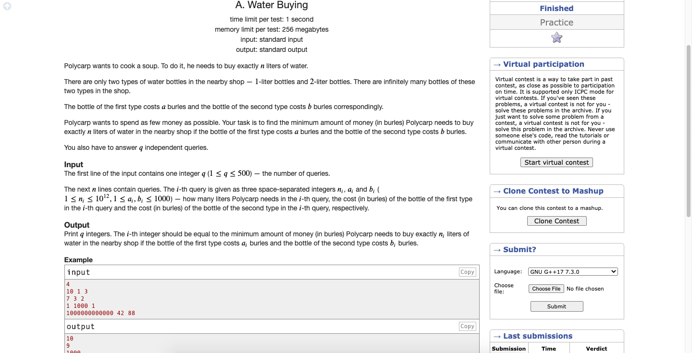

# Codeforces-1118A-Water-Buying
### Problem

### Program Simulation
<pre>
    Sample Input: 10 1 3

    print (10 / 2) * min (2 * 1, 3) + (10 % 2) * 1 
          = 5 * (2 + 0 * 1)
          = 5 * 2
          = 10
    Final Output:
    10
   

   Sample Input: 7 3 2

   print (7 / 2) * min (2 * 3, 2) + (7 % 2) * 1
         = 3 * (2 + 1 * 1)
         = 3 * (2 + 1)
         = 3 * 3
         = 9
   Final Output:
   9
 </pre>
